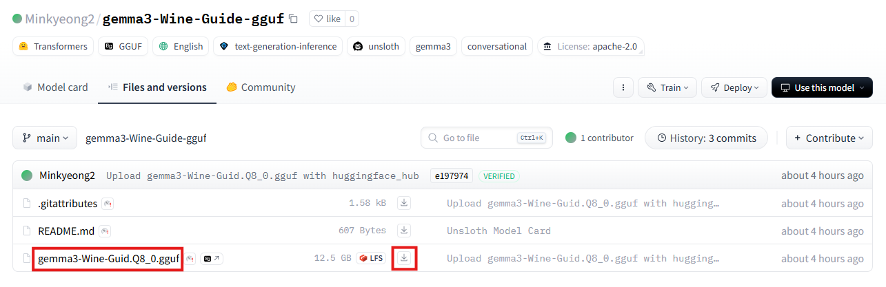
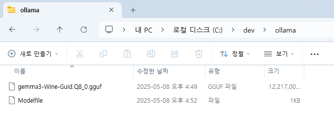

# SKN10-4th-2Team

<br/>

## 와인 초보 입문 가이드 챗봇

<br>

## 1. 서비스 개요

**와인 초보 입문 가이드 챗봇**은 와인에 대한 지식이 부족한 초보자를 위해, 음식 페어링, 와인 용어 해석, 입문용 추천 정보를 **AI 기반으로 정확하고 다단계 평가 방식**으로 안내하는 **와인 초보자 맞춤형 챗봇 서비스**입니다.

<br>

## 2. 서비스 기획 배경

- 🍇 와인 정보의 복잡함
  → 라벨, 품종, 빈티지 등 구조화되지 않은 정보가 많아 진입장벽이 높음

- 🧀 실용적인 음식 페어링 정보 부족
  → 한식, 매운 음식 등 실생활 기반 궁합 정보 부족

- 📱 비대면 와인 큐레이션 수요 증가
  → 홈술 트렌드와 입문자 증가로, 대화형 정보 탐색 니즈 확대

<br>

## 3. 사용자 경험 흐름 (UX 시나리오)

### ✅ 사용자 입력 단계

- 질문 예시
  - “삼겹살에 어울리는 와인 뭐가 있어요?”
  - “까쇼 블렌딩이 뭔 뜻이에요?”
  - “2~3만 원대 입문용 레드 추천해줘요”
➡️ ‘**와인 추천 받기**’ 버튼 클릭

### 🤖 챗봇 응답 프로세스

```markdown
1. 사용자 질문 → sLLM이 1차 응답 A 생성
2. GPT-4o-mini가 A의 신뢰도와 연관성 평가
3. 불충분한 경우 → FAISS 기반 RAG로 내부 와인 문서 검색 → 응답 B 생성
4. 다시 GPT-4o-mini가 응답 B 평가
5. 여전히 부족하면 → Tavily API로 외부 콘텐츠 요약 → 최종 응답 C 생성
6. 사용자에게 가장 신뢰도 높은 결과 제공
```

<br>

## 4. 기술 구성 요소

### 🧠 LLM 및 평가 모델

- 1차 응답 생성: Fine-tuned sLLM (와인 용어·페어링 문체 학습)
- 응답 평가: GPT-4o-mini (OpenAI API 기반, 응답 적절성 평가)

### 🔍 검색 기반 QA (RAG)
- GPT 판단 후 부정확한 경우 → FAISS 기반 내부 문서 벡터 검색
- 관련 콘텐츠를 sLLM에 프롬프트로 주입해 응답 재생성
- 최종 보완 필요 시 → Tavily 웹 검색으로 요약 보완

### 💻 시스템 구성
- 백엔드: Django (Python)
- 프론트엔드: HTML, CSS, Django Template 기반 UI
- 모듈 흐름: 사용자 입력 → sLLM → GPT-4o-mini → RAG 검색 → Tavily 보완

<br>

## 5. 데이터 소스

### Fine-Tuning - 유튜브 자막 기반

- [**세상의 모든 와인 All that wine**](https://www.youtube.com/@allthatwine/playlists)
  - 와인 테이스팅의 모든 것
  - [중급 강의]30분만에 끝나는 '와인 이제 좀 안다!' 클래스
  - [초급 강의]30분만에 끝나는 와인 인생초보 탈출
  - 와인추천
  - 와인 지역별 비교
  - 와인 품종별 비교
  - 와인기초상식식
- [**와푸밸 Wine Food Balance**](https://www.youtube.com/@winefoodbalance1143/playlists)
  - [와인 추천]
  - [와인 상식, 와인 꿀팁]
  - [음식과 와인 조합]

📌 해당 재생목록 영상들의 자막 데이터를 통해 와인에 대한 지식, 와인 추천 등에 대한 정보를 추출하여 모델을 학습시킨다.


### RAG

- [**WINE21.COM**](https://www.wine21.com/13_search/wine_list.html)

📌 해당 사이트에서 필요한 정보를 `request`, `BeautifulSoup`, `Selenium`을 통해 추출하여 사용하였다.

<br>

## 5-1. 데이터셋 생성

### 1. 데이터 수집

`yt-dlp` 라이브러리를 사용하여 유튜브 영상의 자막 데이터를 추출한다.

### 2. 전처리 과정

- 자막 내 불필요한 요소 제거
- 와인과 직접적인 관련이 없는 단어 또는 문장 제거
- 음성 인식 오류로 잘못 표기된 단어 수정
- 특수문자 및 이모티콘 제거
- 띄어쓰기

### 3. 질문-답변 데이터셋 생성

전처리된 자막 데이터를 기반으로 `gpt-4o-mini` 모델을 사용하여 요리 과정을 중심으로 한 질문-답변 데이터셋을 생성한다.

<br>

## 6. 사용자 케이스별 활용 예시

| 케이스 유형 | 설명 | 챗봇 기능 |
|-------------|------|-----------|
| 🍛 음식 페어링 | 삼겹살, 매운탕, 치즈 등과 어울리는 와인 추천 | 추천 와인 + 페어링 이유 제공 |
| 📘 와인 용어 해설 | 까쇼, 블렌딩, 빈티지, 바디감 등 전문용어 풀이 | 용어 설명 + 연관 예시 와인 안내 |
| 🍷 구매 가이드 | 입문자용 가격대, 인기 품종 추천 | 가격대별 와인 추천 + 구매 팁 제공 |

<br>

## 7. 확장 가능성 및 고도화 아이디어

| 기능 | 설명 |
|------|------|
| 📷 라벨 이미지 인식 | 와인 라벨 이미지로 품종 및 설명 자동 추출 |
| 🛒 쇼핑몰 연동 | 추천 와인에 바로 연결되는 구매 링크 제공 |
| 📓 테이스팅 노트 기록 | 사용자가 마신 와인을 기록해 개인화 추천 정밀도 향상 |

<br>

## 8. 요약 및 기대 효과

- ✅ 와인 입문자의 학습과 실용 소비를 동시에 지원
- ✅ 사용자 질문 기반의 정확한 추천 및 해설로 신뢰성 있는 콘텐츠 제공
- ✅ 와인 문화 확산 및 커머스 연계 가능성 확보

<br>

## 9. 응답 생성 및 서비스 동작 프로세스

```markdown
1. 사용자 질문 입력
   ↓
2. 카테고리 분류 (wine, grape, region, producer, etc)
   ↓
3. 카테고리에 따라 분기 처리

   ├─ [Greeting] → LLM 응답 (즉시 반환)
   ├─ [ETC] → LLM 응답 → 관련성 평가
   │            ├─ 관련성 있음 → ✅ 반환
   │            ├─ 관련성 없음 → 내부 문서 검색 → 응답 생성 → 평가
   │            │                      ├─ 관련성 있음 → ✅ 반환
   │            │                      └─ 관련성 없음 → 외부 검색(Fallback)
   │            └─ 결과 없음 → 외부 검색 (Tavily)
   │
   └─ [ wine / grape / region / producer ]
         ↓
      4. Multi Query 생성 (서브 질문 2개)
         ↓
      5. 각 서브 질문에 대해 LLM 응답 생성
         ↓
      6. 관련성 평가 (GPT-4o-mini)
         └─ 관련성 있는 응답이 있다면 → 저장
         ↓
      7. 내부 문서 검색 (FAISS + CrossEncoder Reranker)
         ↓
      8. 문서 기반 응답 생성 (Gemma2-9b-it)
         ↓
      9. 관련성 평가
         ├─ 관련성 있음 → ✅ 반환
         └─ 관련성 없음
               ├─ 서브 질문 LLM 응답 중 최고 관련 응답이 있다면 → ✅ 반환
               └─ 모두 부족할 경우 → 외부 검색 (Tavily + Gemma 요약) → ✅ 반환
```

<br>

## 10. 설치 및 실행 방법

**와인 초보 입문 가이드 챗봇 서비스**를 실행하기 위해서는 아래의 단계를 따라야 한다.

### 📁 1. 프로젝트 클론

```bash
git clone https://github.com/SKNETWORKS-FAMILY-AICAMP/SKN10-4th-2Team.git
```

### 🧪 2. 가상환경 생성 및 라이브러리 설치

```bash
uv venv .venv -p [파이썬 버전 ex) 3.13]
.\.venv\Scripts\activate
uv pip install -r requirements.txt
```

### 🧠 3. Ollama 모델 설치

Hugging Face에 등록된 모델을 사용하기 위해 `.gguf` 파일을 다운로드하여 Ollama에 설치한다.<br/>
자세한 설치 방법은 `10-1`을 참고한다.

### 🔐 4. 환경 변수 설정 (.env 파일 생성)

`.env` 파일을 프로젝트 루트 디렉터리에 생성하고, 다음 내용을 추가해야 한다:

```env
GROQ_API_KEY=[your_groq_api_key]
OPENAI_API_KEY=[your_openai_api_key]
HF_TOKEN=[your_huggingface_token_api_key]
```

### 🚀 5. 실행
Django를 사용하는 경우:

```bash
python manage.py makemigrations
python manage.py migrate
python manage.py runserver
```

<br>

## 10-1. Ollama 모델 설치

### 📥 1. `.gguf` 파일 다운로드

[**Hugging Face 모델**](https://huggingface.co/Minkyeong2/gemma3-Wine-Guide-gguf) 페이지에서 `.gguf` 확장자를 가진 파일을 다운로드한다.



### 🗂️ 2. Modelfile을 통한 모델 설치

#### 📁 2-1. 파일 위치 지정

Hugging Face에서 다운로드한 `.gguf` 파일과 `Modelfile`을 동일한 디렉토리에 위치시킨다.



#### 📝 2-2. Modelfile 수정

Modelfile 내 `FROM` 구문을 다운로드한 `.gguf` 파일 이름으로 수정한다.

```dockerfile
FROM gemma3-Wine-Guid.Q8_0.gguf

TEMPLATE """{{- if .System }}
<s>{{ .System }}</s>
{{- end }}
<s>Human:
{{ .Prompt }}</s>
<s>Assistant:
"""

SYSTEM """A chat between a curious user and an artificial intelligence assistant. The assistant gives helpful, detailed, and polite answers to the user's questions."""

PARAMETER temperature 0
PARAMETER num_predict 3000
PARAMETER num_ctx 4096
PARAMETER stop <s>
PARAMETER stop </s>
```

#### ⚙️ 2-3. Powershell을 통한 모델 추가

다음 명령어를 통해 Local 환경에 모델을 설치한다.

```shell
cd [.gguf 및 Modelfile 위치]
ollama create gemma3-wine -f Modelfile
```

설치가 완료되면 `ollama list` 명령어로 모델이 추가된 것을 확인할 수 있다.


<br>

## 11. 이슈 및 해결방법

### 1. 

<br>

## 12. 회고

### 문승기


### 배민경


### 신민주


### 좌민서


### 홍승표


<br>